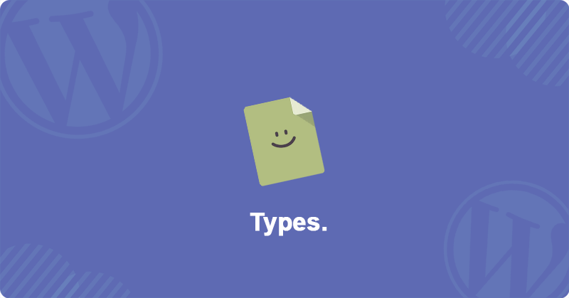

<p align="center">
    
</p>

<div align="center">
<h2>Types.</h2>
<h3>A developer friendly Custom Post Type registration method.</h3>
</div>

# Types
This plugin uses [PostTypes](https://github.com/jjgrainger/PostTypes) to register post types. this plugin is a registeration method that extends these these classes.

# Features

- Developer Friendly
- Reusable
- Customizable
- Type and Taxonomy Notices
- Column support
- Custom column loading
- ACF loading
- SVG Support
- Save Function

# Links

- [jjgrainger](https://github.com/jjgrainger/)  
- [PostTypes](https://github.com/jjgrainger/PostTypes)

# Setup
After installing types to your wordpress instance create a new folder named templates and a folder within that named brick in your themes directory ```themesdir/types/``` this folder is the home for all your new Custom Post Types.  
included in the plugin directory there is a folder named example. this folder contains a readme and an example **Types** post type. you can copy them to your new directory or continue with the documentation.

# Creating Types
If you have created your types folder path from [Setup](#setup) your halfway there.

# Type
All custom post types live in folders that contain all required files to load taxonomoies, custom fields and callbacks.

For this example we will create a new Type called **hogwarts**  
```themesdir/types/hogwarts/```  

in this folder create a JSON file named ```type.json``` with the following json layout.  

**Note: this naming is required all lowercase**

```json
{
  "info": {
    "name": "hogwarts",
    "singular": "Hogwarts",
    "plural": "Hogwarts",
    "slug": "hogwarts",
    "with_front": true
  },
  "labels": {
    "menu_name": "Hogwarts",
    "add_new": "Add New Hogwarts Student",
    "add_new_item": "Add New Hogwarts Student"
  },
  "options": {
    "has_archive": false,
    "show_in_rest": true,
    "public": true,
    "show_ui": true,
    "show_in_menu": true,
    "capability_type": "post",
    "show_in_admin_bar": true,
    "show_in_nav_menus": true,
    "menu_position": 20,
    "query_var": true,
    "supports": [
      "title", 
      "editor", 
      "comments", 
      "revisions", 
      "trackbacks", 
      "author", 
      "excerpt", 
      "page-attributes", 
      "thumbnail", 
      "custom-fields", 
      "post-formats"
    ]
  },
  "columns": {
    "hide": [
      "date",
      "excerpt",
      "author",
      "comments",
      "categories",
      "tags",
      "taxonomy-houses"
    ],
    "add": {
      "house": "House"
    }
  },
  "icon": "dashicons-admin-post"
}
```
the following json is a build up of the new Type all this information can be found.  
all options are supported and can be found here [Register Post Type](https://developer.wordpress.org/reference/functions/register_post_type/)

**Columns**
The columns array there is 2 keys Hide and Add
With hide you only need to extend the array with the key you wish to remove.  
With Add you you define the Key and Value. the value is used for the label and key is the key.

# Taxonomy
If you wish to register taxonomies to your new Type you can create a file in the Type folder you created ```taxonomy.json```  
**Note: this naming is required all lowercase.**  
**Note: this json is in array as you can extend to have multiple taxonomies per Type.**  
```json
[
  {
    "info": {
      "name": "houses",
      "singular": "House",
      "plural": "Houses",
      "slug": "house"
    },
    "options": {
      "hierarchical": false,
      "show_in_rest": true
    },
    "labels": {
      "add_new_item": "Add New House"
    },
    "order": {
      "skill_icon": 2
    },
    "sortable": [
      "house"
    ],
    "columns": {
      "hide": [
        "date",
        "excerpt",
        "author",
        "comments",
        "categories",
        "tags",
        "slug",
        "posts",
        "description"
      ],
      "add": {
        "icon": "Icon"
      }
    }
  }
]
```
**Columns**
The columns array there is 2 keys Hide and Add
With hide you only need to extend the array with the key you wish to remove.  
With Add you you define the Key and Value. the value is used for the label and key is the key.

# Icon
if you wish to use a custom SVG icon as your new Type icon you can add a new file to the Type folder you created ```icon.svg```  
**Note: you the SVG must be named icon all lowercase.**

# Save
if you wish to perform an action on save you can do this by creating a `save.php` in the type folder
the save.php has access to a few variables to help.
Example
```php
/**
 * @param $postid (Int) // Post ID
 * @param $post_type (Object) // the current post type loaded this includes all options loaded by this plugin
 * @param $post_data (Object) // the $_POST data sent to the server
 * @param $post_meta (Object) // The Post Meta all santized and unserialised for ease of use.
 */
$post_data['post_title'] = $post_data['post_title'] . ' (Hello World)';
update_post_meta($postid, 'post_title', $post_data['post_title']);
```

# Advanced Custom Fields
Each type and Taxonomy extends the ability to have custom fields aserted to them. How types registers these is using specific namespacing within a specific ```acf/``` folder

For extending local ACF fields to the Type  
```acf/type-acf.json```  
**From this example**  
```json
[
  {
    "title": "Student Information",
    "fields": [
      {
        "label": "Current Classroom",
        "name": "Current Classroom",
        "type": "text"
      }
    ]
  }
]
```  
For extending the local ACF fields of Taxonomies  
```acf/tax-{ taxonomy.json info->name }-acf.json```  
**From this example**  
```acf/tax-houses-acf.json```  
```json
[
  {
    "title": "House Information",
    "fields": [
      {
        "label": "House Icon",
        "name": "icon",
        "type": "image",
        "return_format": "array"
      }
    ]
  }
]
```

Notice location matching is missing. to convert your existing local acf to this format just return the field groups into a blank object.

# Columns
If you decided to add new columns to either your Type or Taxonomy you can extend its output on the table with the values or information you require.
Create a new folder called ```columns/``` in your Types folder.  
all callbacks use unique name spacing based off the column you defined

For extending columns to the Type  
```columns/type-{type.json columns->add-> key}.php```  
**From this example**  
```columns/type-house.php```  
**Example of callback php**  
```php
/**
* Availble variables:
* @param $column
* @param $post_id
*/
$awaiting = 'Awaiting the sorting hat.';
$terms = get_the_terms( $post_id, 'houses' );
if ( $terms && !is_wp_error( $terms ) ) {
    $houses = array();
    foreach ( $terms as $term ) {
        $houses[] = $term->name;
    }
    echo !empty($houses) ? join( ', ', $houses ) : $awaiting;
} else echo $awaiting;
```  

For extending columns of Taxonomies  
```columns/tax-{taxonomy.json info->name}-{taxonomy.json columns->add-> key}.php```  
**From this example**  
```columns/type-houses-icon.php```  
**Example of callback php**  
```php
/**
* Availble variables:
* @param $content
* @param $column
* @param $term_id
* @param $taxonomy
* @param $term_meta
*/
//get icon from this taxonomy
$icon = get_field('icon', $taxonomy . '_' . $term_id);
if($icon) echo '';
```

# Notices
Notices are small alerts that appear in the Post, Edit, Taxonomy, Taxonomy edit screens.
to extend notices for your Types or Taxonomies create a new folder ```notice/```  

all callbacks use unique name spacing based off the type or taxonomy you defined.  
For extending notice to the Type  
```notice/type-post.php```  
```notice/type-edit.php```  
**From this example**  
```php
/**
 * Availble variables:
 * @param $screen
 * @param $notices
 * 
 */
<div class="notice notice-success is-dismissible">
    <p>Example Custom post type notice</p>
    <button type="button" class="notice-dismiss"><span class="screen-reader-text">Dismiss this notice.</span></button>
</div>
```  
For extending notice to the Taxonomy  
```notice/tax-{taxonomy.json info->name}-edit.php```  
```notice/type-{taxonomy.json info->name}-term.php```  
**From this example**  
```php
/**
 * Availble variables:
 * @param $screen
 * @param $notices
 * 
 */
<div class="notice notice-success is-dismissible">
    <p>Example Custom post type notice</p>
    <button type="button" class="notice-dismiss"><span class="screen-reader-text">Dismiss this notice.</span></button>
</div>
```  

